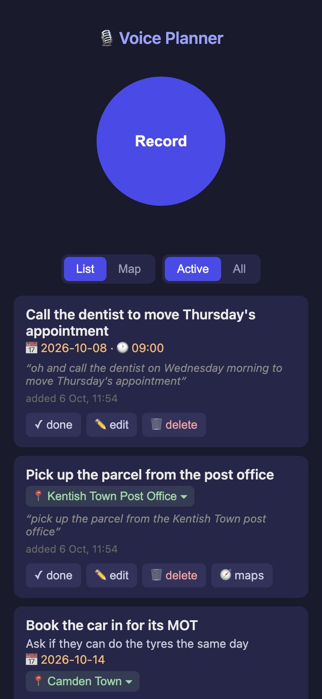

# Voice Planner

Turn rambling voice notes into a clean to-do list. You record a voice note on
your phone, the phone sends it to a Raspberry Pi over Tailscale, and the Pi:

1. transcribes the audio with OpenAI's speech-to-text API
2. asks a GPT model to pull out individual tasks — a short title, plus
   deadline, location, and extra details (description), each only if you
   actually mentioned them
3. appends the tasks to a local file (`data/tasks.jsonl`)
4. adds each task to your Google Tasks list
5. replies to your phone with the extracted tasks

<p align="center"></p>

It runs as a small systemd service (Flask + Waitress, one worker) and is
designed to sit quietly next to other things on the Pi — it uses port **8484**
(clear of Immich's 2283) and is capped at 300 MB of RAM by systemd.

```
voice-planner/
├── planner/                  # the service
│   ├── server.py             #   web server + request pipeline
│   ├── transcribe.py         #   audio -> text (OpenAI)
│   ├── extract.py            #   text -> structured tasks (OpenAI)
│   ├── storage.py            #   append to data/tasks.jsonl
│   └── gtasks.py             #   add tasks to Google Tasks
├── scripts/google_auth.py    # one-time Google login
├── install.sh                # one-shot setup on the Pi
├── voice-planner.service     # systemd unit template
├── requirements.txt
└── .env.example              # copy to .env and fill in
```

**Secrets never live in the repo.** `.env` (API keys), `google/` (OAuth
credentials + token), and `data/` (your tasks) are all in `.gitignore`. Before
any `git push`, a quick `git status` should never show those paths.

---

## 1. Install Tailscale on the Pi

Tailscale gives your phone a private, encrypted path to the Pi from anywhere —
no port forwarding, nothing exposed to the internet. It's installed
system-wide, so anything you add to the Pi later (e.g. an Immich photo server)
reuses the same setup.

On the Pi (over SSH):

```bash
curl -fsSL https://tailscale.com/install.sh | sh
sudo tailscale up
```

`tailscale up` prints a login URL — open it on your laptop and log in (Google,
GitHub, etc.). Then check it worked:

```bash
tailscale status
```

Note your Pi's Tailscale name (something like `raspberrypi.tail1234.ts.net`)
or its `100.x.y.z` IP — your phone will send audio to that address.

Finally, install the **Tailscale app on your phone** and log in with the same
account. That's it: phone and Pi can now reach each other from anywhere.

## 2. Install the planner on the Pi

Copy this folder to the Pi and run the installer:

```bash
# from your laptop
scp -r voice-planner <user>@<pi-address>:~

# on the Pi
cd ~/voice-planner
./install.sh
```

The installer installs Python bits, creates a virtual environment, installs
dependencies, and registers the systemd service (enabled on boot, but you
still need to fill in `.env` before starting it).

## 3. Set up `.env`

```bash
cd ~/voice-planner
nano .env
```

Two values are required:

- `OPENAI_API_KEY` — from [platform.openai.com](https://platform.openai.com/api-keys)
- `PLANNER_TOKEN` — a secret your phone must send with every upload. Generate
  one with `openssl rand -hex 24` and paste it in. You'll use the same value
  in the phone Shortcut later.

Then start the service:

```bash
sudo systemctl start voice-planner
curl http://localhost:8484/health     # should print {"status":"ok"}
```

At this point voice notes already work end-to-end **except** Google Tasks —
tasks are transcribed and saved to the local file, and the response tells you
Google isn't connected yet.

## 4. Google Tasks one-time setup

This is the only fiddly part, and you only do it once.

**A. Create a Google Cloud project and enable the Tasks API**

1. Go to [console.cloud.google.com](https://console.cloud.google.com) and log
   in with the Google account whose Tasks list you want to use.
2. Top bar → project picker → **New project** → name it e.g. `voice-planner`.
3. With that project selected: **APIs & Services → Library**, search for
   **Google Tasks API**, click it, **Enable**.

**B. Set up the consent screen**

1. **APIs & Services → OAuth consent screen** (may appear as "Google Auth Platform").
2. User type: **External** → Create.
3. App name `voice-planner`, pick your email for the required fields, save
   through the remaining steps (you can skip scopes and test users).
4. Back on the consent screen page, click **Publish app** and confirm. This
   sounds scarier than it is: nobody else can use it without your client
   secret, and it matters because *unpublished* ("Testing") apps get logins
   that expire every 7 days — published ones stay logged in forever.

**C. Create the OAuth client**

1. **APIs & Services → Credentials → Create credentials → OAuth client ID**.
2. Application type: **Desktop app**, any name.
3. **Download JSON**, then copy it to the Pi as `google/client_secret.json`:

   ```bash
   scp ~/Downloads/client_secret_*.json <user>@<pi-address>:~/voice-planner/google/client_secret.json
   ```

**D. Authorize your account**

The login page has to open in a real browser, so connect to the Pi with a
tunnel and run the auth script:

```bash
ssh -L 8899:localhost:8899 <user>@<pi-address>
cd ~/voice-planner
.venv/bin/python scripts/google_auth.py
```

Open the URL it prints **in your laptop's browser**, log in, and approve.
(Google will warn the app is unverified — click "Advanced" → continue; it's
your own app.) The script saves `google/token.json`, which refreshes itself
automatically from then on. Restart the service:

```bash
sudo systemctl restart voice-planner
```

## 5. Using it from your phone

### The record page (recommended)

The Pi serves a one-button record page at `/`: open it, tap **Record**, talk,
tap **Stop**, and your tasks appear on screen. The page is also a small task
manager:

- **Edit / complete / delete** any task inline. Deleting archives it (it
  leaves the list and Google Tasks, but stays in the local DB forever).
- **Times of day**: "call the plumber at half past five" stores 🕐 17:30 next
  to the date. (Google Tasks' API only holds a date, so the time shows in the
  Google task's notes instead.)
- **Voice editing too**: a note can change the list, not just add to it —
  "actually, cancel the dentist appointment" deletes it, "move the haircut to
  Saturday" reschedules it, "I picked up the cake" completes it. The extractor
  sees your current list and returns add/update/complete/delete actions; if it
  can't confidently match the task you meant, it does nothing and tells you.
- **Two-way Google Tasks sync**: changes made in the Google Tasks app
  (deletes, completions, renames, due dates, even new tasks) appear here on
  the next page load, and edits made here push to Google immediately.
- **Maps**: tasks with a location get a 📍 chip that unfolds a mini
  [Leaflet](https://leafletjs.com) map, and the **Map view** shows all located
  tasks as pins. Locations are geocoded via OpenStreetMap's Nominatim, and the
  location editor has type-ahead place search.
- **Optional: business names on the map.** OpenStreetMap finds streets and
  cities but not most named businesses ("Παπαδάκης οδοντίατρος"). To resolve
  those too, add a `GOOGLE_PLACES_API_KEY` to `.env` — it's used only as a
  fallback when OpenStreetMap comes up empty. Get one in the same Google
  Cloud project you use for Tasks: enable **Places API (New)** in the API
  Library, then **Credentials → Create credentials → API key** (restrict it
  to the Places API). Note: Google requires billing to be enabled on the
  project for Places, but personal use stays comfortably inside the free
  monthly allowance.

Storage on the Pi is two-layer: `data/tasks.jsonl` is the append-only journal
of every voice note (never modified — the archive), and `data/tasks.db`
(SQLite) is the live task list that editing and sync operate on.

Works the same on Android, iPhone, and laptops — no extra apps beyond
Tailscale.

Browsers only allow microphone access over HTTPS, so use Tailscale's built-in
HTTPS (one-time setup):

1. Enable HTTPS certificates for your tailnet: run `sudo tailscale serve status`
   on the Pi — if serve isn't enabled yet it prints the admin-console link to
   click. Enable **HTTPS certificates** only; you do *not* need Tailscale
   Funnel (that's for exposing services to the public internet — skip it).
2. On the Pi:

   ```bash
   sudo tailscale serve --bg http://localhost:8484
   ```

   This proxies `https://<pi-name>.<tailnet>.ts.net` → the planner, visible
   **only inside your tailnet** (the output says "tailnet only"). It survives
   reboots.

Then on your phone (with Tailscale connected): open
`https://<pi-name>.<tailnet>.ts.net`, paste your `PLANNER_TOKEN` once (it's
remembered), and add the page to your home screen for an app-like icon.

### Alternative: iPhone Shortcut

In the **Shortcuts** app, create a new shortcut with two actions:

1. **Record Audio** — Quality: Normal, Start Recording: Immediately,
   Stop Recording: On Tap.
2. **Get Contents of URL** — set the URL to
   `http://<pi-tailscale-name>:8484/note`, then expand the options:
   - Method: **POST**
   - Headers: add one — key `Authorization`, value `Bearer <your PLANNER_TOKEN>`
   - Request Body: **Form**, add one field — type **File**, key `audio`,
     value: the **Recorded Audio** variable from step 1.
3. (Optional) **Show Result** — so you see the extracted tasks pop up.

Name it something like "Brain dump", add it to your home screen, or wire it to
the Action Button / Back Tap. Make sure the Tailscale app is connected when
you use it.

### Alternative: Android without the record page

Use the free [HTTP Request Shortcuts](https://play.google.com/store/apps/details?id=ch.rmy.android.http_shortcuts)
app (plus the Tailscale app, logged in to the same account):

1. Create a new shortcut: **POST** to `http://<pi-tailscale-address>:8484/note`.
2. Headers: `Authorization` = `Bearer <your PLANNER_TOKEN>`.
3. Request Body: **Form Data**, one parameter of type **file** named `audio`.
4. Response Handling: show response in a **dialog** (so you see your tasks).
5. Enable the shortcut as a **share target** in its execution settings.

Then record a note in any recorder app (Google/Samsung recorders' `.m4a` and
`.ogg` files are accepted as-is) and **Share** it to the shortcut. Tapping the
shortcut directly opens a file picker instead.

## 6. Checking on it

```bash
sudo systemctl status voice-planner        # is it running?
journalctl -u voice-planner -f             # live logs
journalctl -u voice-planner --since today  # today's logs
curl http://localhost:8484/health          # liveness check
```

Test the whole pipeline without the phone (any voice memo file works):

```bash
curl -X POST http://localhost:8484/note \
  -H "Authorization: Bearer <your PLANNER_TOKEN>" \
  -F "audio=@test-note.m4a"
```

Your tasks accumulate in `data/tasks.jsonl` — one JSON line per voice note,
with a timestamp, the full transcript, and the extracted tasks. If task
extraction ever fails, the line is still written with the raw transcript so
nothing is lost.

## Behaviour notes

- **Errors don't kill the service.** A failed upload, a bad transcription, or
  a Google hiccup returns an error/partial response to your phone and logs the
  details; the service keeps running. If Google Tasks fails, the tasks are
  still in the local file.
- **Formats:** `.m4a` (what iPhone records), `.mp3`, `.wav` and friends are
  sent to OpenAI as-is — no conversion step needed. Max upload 30 MB.
- **Cost:** defaults are `gpt-4o-mini-transcribe` + `gpt-4o-mini`; a typical
  one-minute note costs a fraction of a cent. Models are swappable in `.env`.
- **Security:** the server rejects every request without the correct
  `Authorization` token (and rejects everything if `PLANNER_TOKEN` is unset).
  It's only reachable over your tailnet — nothing is exposed to the internet.
